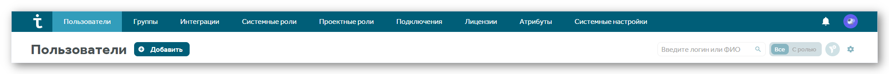

# Добавление, редактирование и удаление пользователей

Вы можете добавлять, удалять и редактировать данные пользователей, добавленных в систему локально, через Active Directory (AD) или через OpenID Connect. Чтобы открыть окно информации о пользователях:

1. Используя аккаунт администратора нажмите на иконку профиля. В открывшемся меню выберите **Администрирование**.
2. В открывшемся окне перейдите в раздел **Пользователи**.

### Добавление пользователей

Вы можете добавлять локальных пользователей в систему TeamStorm:

1. В разделе **Пользователи** нажмите **Добавить**.
2. В открывшемся окне укажите:
   * Логин пользователя - под этим логином пользователь сможет входить в систему.
   * Пароль пользователя.
   * E-mail пользователя.
   * ФИО - указанное имя будет отображаться в системе TeamStorm.
3. Нажмите **Добавить**.

После добавления новому пользователю присваивается системная роль.

Чтобы назначить системные роли пользователям:

1. Используя аккаунт администратора, нажмите на иконку профиля. В открывшемся меню выберите **Администрирование**.
2. В открывшемся окне перейдите в раздел **Системные роли**. В разделе отобразятся все пользователи и группы, добавленные в систему.
3. Если нужный пользователь не отображается, начните вводить его имя или логин в поле **Добавить пользователя**, далее выберите пользователя из результатов поиска.&#x20;
4. Поставьте флажок роли, которую вы хотите дать определенному пользователю или группе пользователей. Роль применится и сохранится автоматически. При добавлении пользователя через AD/LDAP к группе у которой есть права в системе, синхронизация может занять около 20 минут.

<figure><figcaption></figcaption></figure>

### Редактирование данных пользователя

После добавления пользователей вы можете просматривать всю информацию о них в разделе **Пользователи**. Используйте фильтр для кастомизации отображаемых данных. Настройки отображения сохраняются для текущего браузера.

Чтобы редактировать данные пользователя:

1. Нажмите на строку пользователя, данные которого хотите отредактировать.
2. Внесите изменения.
3. Нажмите **Сохранить**.

Вы можете менять данные только для локальных пользователей. Данные пользователей, добавленных через AD необходимо менять в AD.

### Удаление пользователей

Чтобы удалить локальных пользователей:

1. Поставьте флажок напротив локального пользователя (пользователей), которого хотите удалить из системы.
2. Нажмите **Удалить**.

<figure><figcaption></figcaption></figure>
