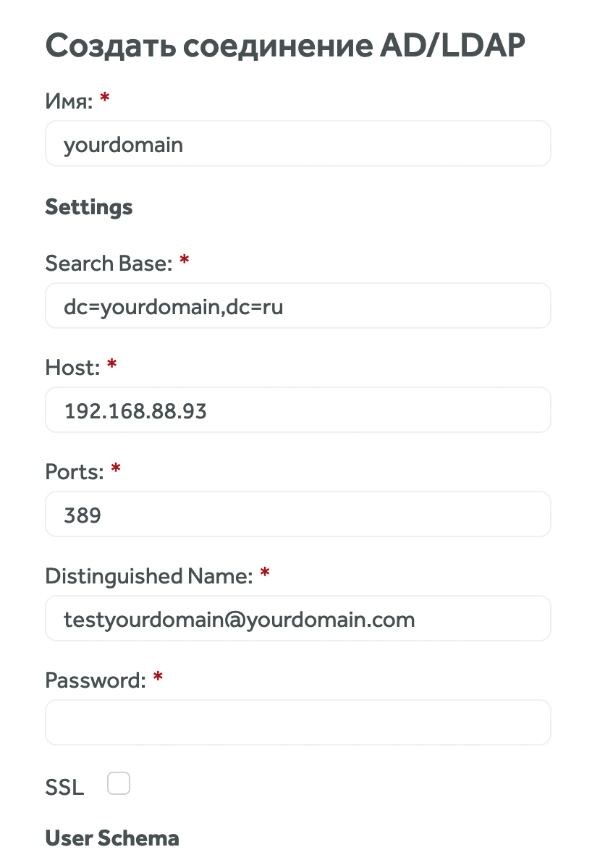

# Руководство администратора TeamStorm по добавлению пользователей

## Назначение документа 

Документ описывает действия администратора по добавлению пользователей и присвоению системных ролей.

## Вход в систему 

Для входа в систему:

1. Откройте страницу входа в TeamStorm.
2. Введите учетные данны администратора в поля **Имя пользователя** и **Пароль.**
3. Нажмите **Войти** или клавишу **** `Enter`**.**

<figure><figcaption></figcaption></figure>

## Настройка подключений через AD/LDAP 

После того, как системный администратор добавил необходимых пользователей в активную директорию (AD), вам необходимо настроить подключение по LDAP в системе TeamStorm.

1. Используя аккаунт с правами администратора, нажмите на иконку пользователя и перейдите в раздел **Администрирование**.
2. На верхней панели нажмите **Подключения**, убедитесь, что вы находитесь на вкладке **AD/LDAP**, нажмите **Создать**.
3. Заполните обязательные поля, нажмите **Протестировать**. В случае успешного тестирования сохраните подключение.

На вкладке **AD/LDAP** доступно редактирование соединения Active Directory (или LDAP) и кнопка для принудительной синхронизации. Чтение и синхронизация происходят каждые 10 минут.

В настройках AD/LDAP можно указывать схему пользователей и групп для поддержки большинства служб.

Реализована возможность добавлять пользователей только из одной группы в AD.

**User Schema:** Пример фильтра для пользователей из одной группы:

(&(objectCategory=Person)(sAMAccountName=\*)(memberOf=CN=Group-Sonya,OU=Sonya-test,OU=podrazdelenie2,OU=Podrazdelenie1,DC=mtest,DC=ru))

Пример фильтра, который добавляет пользователей из вложенных групп:

(&(objectCategory=Person)(sAMAccountName=\*)(memberOf:1.2.840.113556.1.4.1941:=CN=Group-Sonya,OU=Sonya-test,OU=podrazdelenie2,OU=Podrazdelenie1,DC=meistertest,DC=ru))

**Group Schema:** Фильтр для одной группы (имя начинается с ..) :

(&(objectCategory=group)(name=Group-Sonya\*))

На странице подключений AD/LDAP можно создать несколько подключений, а также выбрать подключение по умолчанию.

Выбранное подключение по умолчанию будет отображаться на странице авторизации как основное.

## Добавление, редактирование и удаление пользователей 

Вы можете добавлять, удалять и редактировать данные пользователей, добавленных в систему локально, через активную директорию (AD) или через OpenID Connect. Чтобы открыть окно информации о пользователях:

1. Используя аккаунт администратора  нажмите на иконку профиля. В открывшемся меню выберите **Администрирование**.
2. В открывшемся окне перейдите в раздел **Пользователи**.

### Добавление пользователей

Вы можете добавлять локальных пользователей в систему TeamStorm:

1. В разделе **Пользователи** нажмите **Добавить**.
2. В открывшемся окне укажите:   
  
      * &#x20;   Логин пользователя - под этим логином пользователь сможет входить в систему.
      * &#x20;   Пароль пользователя.
      * &#x20;   Email пользователя.
      * &#x20;   ФИО - указанное имя будет отображаться в системе TeamStorm.
5. Нажмите **Добавить**.

После добавления новому пользователю присваивается системная роль пользователя «Пользователь TeamStorm». Таким образом, добавленный пользователь может совершать действия системе TeamStorm.

### Редактирование данных пользователя

После добавления пользователей вы можете просматривать всю информацию о них в разделе **Пользователи**. Используйте фильтр 

для кастомизации отображаемых данных. Настройки отображения сохраняются для текущего браузера.

Чтобы редактировать данные пользователя:

1. Нажмите на строку пользователя, данные которого хотите отредактировать.
2. Внесите изменения.
3. Нажмите **Сохранить**.

Вы можете менять данные только для локальных пользователей. Данные пользователей, добавленных через AD необходимо менять в AD.

### Удаление пользователей

Чтобы удалить локальных пользователей:

1. Поставьте флажок напротив локального пользователя (пользователей), которого хотите удалить из системы.
2. Нажмите **Удалить**.

