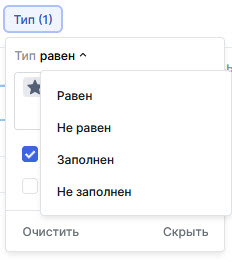

# Инструкция по эксплуатации TeamStorm

## Назначение документа 

Документ описывает работу пользователей в системе TeamStorm.

## Описание ролей пользователей Системы

### Core Admin

Роль **Core Admin** предназначена для:

* добавления лицензий продукта;
* выдачи системных ролей пользователям и группам пользователей.

После входа в систему пользователя с ролью **Core Admin** у него будет автоматически **** открыт раздел **Администрирование.**&#x20;

Подробнее работа с разделом **Администрирование** описана в [Руководстве администратора](rukovodstvo-administratora-teamstorm-po-dobavleniyu-polzovatelei.md).

### Пользователь TeamStorm

Роль **Пользователь TeamStorm** предназначена для работы с основной функциональностью системы.&#x20;

После входа в систему пользователя с ролью **Пользователь TeamStorm** у него будет автоматически открыта [#glavnaya-stranica](rukovodstvo-polzovatelya-teamstorm.md#glavnaya-stranica "mention").

## Вход в систему 

### С использованием TestIT

1. Откройте страницу входа, общую для TeamStorm и TestIT.
2. Выберите локальную учетную запись или вход из домена, если настроены подключения к LDAP-серверам, например к Active Directory, для авторизации с помощью пользователя AD.&#x20;
3. **Опционально:** поставьте флажок **Запомнить меня**, чтобы не вводить учетные данные при следующем открытии браузера.
4.  Введите учетные данные пользователя и нажмите **Войти**.&#x20;

    <figure><figcaption></figcaption></figure>
5. На открывшейся главной странице системы TestIT нажмите иконку выбора продукта  в правом верхнем углу экрана.
6.  Выберите TeamStorm.

    <figure><figcaption></figcaption></figure>

### Без использования TestIT

1. Откройте страницу входа в TeamStorm.
2. В выпадающем списке выберите тип пользователя, с помощью которого вы войдете в систему. По умолчанию указано значение Local — локальный пользователь TeamStorm . Дополнительно в списке могут отображаться подключения к LDAP-серверам, например к Active Directory, для авторизации с помощью пользователя AD.
3. Введите учетные данные пользователя в поля **Имя пользователя** и **Пароль.**
4. **Опционально:** поставьте флажок **Запомнить меня**, чтобы не вводить учетные данные при следующем открытии браузера.
5. Нажмите **Войти** или клавишу `Enter`**.**

<figure><figcaption></figcaption></figure>

## Главная страница

В результате успешного входа в систему откроется **Главная страница.**

На **Главной странице** отображается:

* количество и список доступных пользователю пространств;
* количество и список назначенных пользователю задач.

Также **Главная страница** содержит поле для поиска задачи и иконку доступа к профилю пользователя.

<figure><figcaption></figcaption></figure>

## Работа с пространствами

Принципы выделения пространства принимаются на уровне организации.

Владелец пространства (пользователь, создавший пространство) может предоставлять доступ к данному пространству другим пользователям.

### Создание пространства

1. На **Главной странице** в блоке пространств нажмите .
2. В открывшемся окне введите:
   * название нового пространства;
   * префикс нового пространства (если префикс не ввести, он присвоится автоматически);
3. Нажмите **Создать**.

<figure><figcaption></figcaption></figure>

Созданное пространство отобразится в списке пространств на **Главной странице**.

#### Первый вход в созданное пространство

1. Нажмите на название пространства в списке пространств на **Главной странице.**
2. В открывшемся окне с надписью "Пространство не содержит папок" перейти к [созданию папки](rukovodstvo-polzovatelya-teamstorm.md#sozdanie-papki) либо к [настройкам пространства](rukovodstvo-polzovatelya-teamstorm.md#nastroika-prostranstva).

<figure><figcaption></figcaption></figure>

### Переход к пространству

Для перехода к ранее созданному пространству нажмите на название пространства в списке пространств слева на **Главной странице.**

На открывшейся странице отобразятся задачи из первой созданной в данном пространстве папки.

.png>)

### Настройки пространства

Доступ к настройкам пространства открывается при

* [первом входе в созданное пространство](rukovodstvo-polzovatelya-teamstorm.md#pervyi-vkhod-v-sozdannoe-prostranstvo) или
* [переходах к ранее созданному пространству](rukovodstvo-polzovatelya-teamstorm.md#undefined) по нажатию кнопки  (1) (2).png>) .

<figure><figcaption></figcaption></figure>

На открывшейся странице вы можете:

* задать название пространства;
* ввести описание пространства;
* удалить пространство.

В левой панели вы можете перейти к

* добавлению или удалению пользователей в пространстве;
* настройке процессов, которые используются в пространстве;
* настройке типов задач, которые используются в пространстве;
* настройке атрибутов, которые используются в пространстве.

<figure><figcaption></figcaption></figure>

#### Добавление и удаление пользователей в пространстве

Для добавления пользователей:

1. В  левой панели окна настроек пространства нажмите **Пользователи**.
2. На открывшемся экране **Пользователи** нажмите **Добавить**.&#x20;
3. В открывшемся модальном окне кликните в поле ввода или начните вводить имя пользователя.
4. Выберите нужных пользователей из открывшегося списка и нажмите в любое место модального окна, чтобы закрыть список.
5. Нажмите **Добавить**.

Добавленные пользователи и их роли будут отображены в списке пользователей.&#x20;

<figure><figcaption></figcaption></figure>

Для удаления пользователей:

1. Выберите пользователя из списка и нажмите .
2. В открывшемся модальном окне нажмите **Да, удалить пользователя из пространства.**

Выбранный пользователь будет удален из пространства.

#### Настройка процессов

Настройка процессов в пространстве описана в разделе [#nastroika-rabochikh-processov](rukovodstvo-polzovatelya-teamstorm.md#nastroika-rabochikh-processov "mention").

#### Создание, удаление и редактирование типов задач

Для создания нового типа задачи в пространстве:

1. В левой панели окна настроек пространства нажмите **Типы задач**.
2. На открывшемся экране **Типы задач** нажмите **Создать**.
3. В открывшемся окне заполните поля:
   * Название;
   * Иконка;
   * Цвет иконки;
   * Процесс.
4. Нажмите **Сохранить**.

<figure><figcaption></figcaption></figure>

Новый тип задачи будет отображен в списке типов на экране **Типы задач**.

Для удаления типа задач из пространства:

1. Выберите в списке тип, который необходимо удалить, и нажмите .
2. В открывшемся модальном окне нажмите **Да, я хочу удалить тип**.

Тип будет безвозвратно удален, все связанные с ним задачи сбросят поле Тип и удалены не будут.

Для редактирования типа задач:

1. Выберите в списке тип, который необходимо отредактировать, и нажмите .
2. В открывшемся окне отредактируйте поля
   * Название;
   * Иконка;
   * Цвет иконки;
   * Процесс.
3. Нажмите **Сохранить**.

#### Создание, редактирование и удаление атрибутов

Для создания нового атрибута:

1. В левой панели окна настроек пространства нажмите **Атрибуты**.
2. На открывшемся экране атрибутов нажмите **Создать**.
3. В открывшемся окне заполните поля:
   * Название (обязательно);
   * Описание;
   * Привязать к типу задачи;
   * Формат (обязательно).
4. Нажмите Сохранить.

<figure><figcaption></figcaption></figure>

Созданный атрибут будет отображен в списке атрибутов для данного пространства.&#x20;

Для удаления атрибута из пространства:

1. Выберите в списке атрибут, который необходимо удалить, и нажмите .
2. Нажмите **Да, я хочу удалить атрибут**.

Удаление атрибута приведет к потере всех значений данного атрибута во всех элементах.

Для редактирования атрибута:

1. Выберите в списке атрибут, который необходимо отредактировать, и нажмите .
2.  Отредактируйте поля:

    * Название;
    * Описание;
    * Привязать к типу задачи.

3. Нажмите **Сохранить**.

Формат атрибута задается при создании и редактированию не подлежит.&#x20;

## Работа с папками

Папка объединяет задачи со схожими процессами и доступами (например, группировка работы по проектам, продуктам, командам).

Конфигурация рабочих процессов и типов для папки соответствует конфигурации пространства.

Пользователь может создавать вложенные папки.

### Создание папки

1. Перейти в пространство, в котором требуется создать папку.
2.  Если пространство не содержит папок, то на открывшейся странице нажмите кнопку **Создать папку.** Если пространство содержит ранее созданные папки, нажмите кнопку  (2) (1).png>) рядом с названием пространства.

    <figure><figcaption></figcaption></figure>
3. В открывшемся окне введите название папки и нажмите **Создать**.

<figure><figcaption></figcaption></figure>

#### Создание вложенной папки

Выполняется аналогично созданию папки в пространстве, но на шаге 2. следует нажать кнопку  (3).png>) напротив названия той папки, в которой вы хотите создать вложенную папку.

<figure><figcaption></figcaption></figure>

### Изменение папки

1. Нажмите  рядом с названием папки и нажмите пункт меню **Настройки**.
2. В открывшемся окне в блоке **Настройки** введите
   * новое название папки;
   * описание папки.
3. Нажмите **Сохранить.**

### Удаление папки

1. Нажмите  рядом с названием папки.
2. В открывшемся окне в блоке **Удаление** введите название удаляемой папки.
3. Нажмите **Удалить.**

## Работа с расширениями

### **Включение расширения (Agile)**

1. Перейдите в нужное пространство.
2. Нажмите  рядом с названием папки,  для которой хотите включить расширение и выберите в меню пункт **Расширения**.
3. Нажмите **Включить Agile**.

В случае выбора расширения **Agile** для выбранной папки будет автоматически создана очередь **Backlog**. Очередь **Backlog** используется для создания упорядоченных по приоритету списков работы команды, которая работает по методологии Agile.&#x20;

Если команда в работе использует фреймфорк Scrum, то выполнение работы организуется с помощью спринтов — фиксированных периодов времени в течение которого будет выполнена вся запланированная в них работа.

Спринт представляет собой упорядоченный список задач. Для спринта устанавливается сроки, длительность и предполагаемый объем работы, который команда может выполнить в указанный срок. Наполнение спринта происходит как правило через **Backlog**. Команда выбирает задачи, которые имеют более высокий приоритет до тех пор, пока не наберет достаточный объем задач.

### Создание спринта в расширении Agile

1. Выберите папку, для которой подключено раcширение **Agile**.
2. При необходимости при помощи навигационных кнопок .png>) разверните список расширений и очередей выбранной папки.
3.  Напротив расширения **Agile** нажмите

    * кнопку вызова меню .png>), затем выберите **Добавить спринт**

    или

    * кнопку  (4).png>).
4. В открывшемся модальном окне заполните  поля:
   * Название;
   * Дата начала;
   * Дата завершения;
   * Описание (заполняется опционально).
5. Нажмите **Создать**.

<figure><figcaption></figcaption></figure>

Будет открыто [представление задач](rukovodstvo-polzovatelya-teamstorm.md#predstavlenie-zadach) для созданного спринта.

### Запуск спринта

В представлении задач выбранного спринта нажмите **Запустить спринт** в верхней правой части представления.

Запущенный спринт будет помечен зеленой точкой в панели навигации справа.

### Редактирование спринта

1. Нажмите  напротив нужного спринта в панели навигации в правой части экрана или в правом верхнем углу в представлении задач выбранного спринта.
2. Измените необходимые данные.
3. Нажмите **Сохранить**.

### Завершение спринта

1. В представлении задач выбранного спринта нажмите **Завершить спринт** в верхней правой части представления.
2. В открывшемся модальном окне нажмите  **Завершить**.

Спринт будет перенесен в архив и его невозможно будет вернуть в очередь. Все незавершенные задачи будут перенесены в **Backlog**.

Завершенный спринт перестанет быть помеченным зеленой точкой в панели навигации слева.

### Удаление спринта

1. Нажмите  напротив нужного спринта в панели навигации в правой части экрана или в правом верхнем углу в представлении задач выбранного спринта.
2. Нажмите **Удалить**.
3. В открывшемся модальном окне нажмите **Да, я хочу удалить спринт**.

Спринт будет безвозвратно удален, все задачи, которые были в спринте, сбросят поле **Спринт** и удалены не будут.


Удалить можно только свежесозданный или запущенный спринт.&#x20;

Завершенный спринт удалить нельзя.


### **Отключение расширения (Agile)**

1. Выберите папку, для которой подключено раcширение **Agile**.
2. Нажмите  рядом с названием папки и выберите в меню пункт **Расширения**.
3. Нажмите **Удалить Agile**.
4. В появившемся модельном окне нажмите **Да, я хочу удалить Agile**.

Расширение будет  удалено, все задачи, которые были добавлены в очереди **Backlog** и **Спринт** сбросят поле **Спринт** и удалены не будут.

## Работа с задачами

В системе доступно создание разных типов задач — структурированных элементов для управления проектом.

Пользователь может:

* вносить информацию о необходимых действиях для выполнения задачи;
* устанавливать исполнителя задачи;
* изменять статус по мере выполнения задачи и закрывать её;
* добавлять вложения (файлы);
* выстраивать иерархию задач, добавляя вложенные задачи;
* оставлять комментарии к задаче;
* создавать к задачам пользовательские атрибуты типов «строка», «тег», «список», «дата», «число»;
* связывать задачи, выстраивая между ними отношения типа «зависимость», «блокирование», «дублирование»;
* указывать рабочий процесс, по которому должна проходить задача.

### Представление задач

Вся информация о выполнении задач отслеживается с помощью двух представлений — «Доска» и «Таблица».

Таблица представляет собой список задач с ее параметрами.&#x20;

Доска представляет собой набор карточек задач, сгруппированных по статусам в колонках доски.

Представления отображают задачи выбранной папки или списка задач. В представлениях доступны [фильтрация и поиск](rukovodstvo-polzovatelya-teamstorm.md#filtraciya-i-poisk) отображаемых задач по названию, статусу, типу и ответственному за задачу.

Для переключения между представлениями нажмите **Доска** или **Таблица** на переключателе в верхней части представления. Выбранный тип представления будет подчеркнут и выделен цветом.

<figure><figcaption>
Представление "Таблица"
</figcaption></figure>

<figure><figcaption>
Представление "Таблица"
</figcaption></figure>

#### Настройка представления

Для представления «Таблица» реализована возможность выбора атрибутов, отображаемых в представлении.&#x20;

1. Переключите представление на тип  «Таблица».
2. Нажмите **Настроить.**
3. В отобразившейся панели отметьте те атрибуты, которые требуется видеть в представлении или снимите отметки с тех атрибутов, которые требуется скрыть.

<figure><figcaption></figcaption></figure>

Таблица представления задач будет содержать столбцы только с отмеченными на панели настройки атрибутами.&#x20;

### Фильтрация и поиск

#### Фильтрация задач

В представлениях задач доступна фильтрация по следующим основным параметрам:

* Статус;
* Ответственный;
* Тип.

Кроме того в представлении «Доска» доступна фильтрация по параметру

* Процессы.

Для фильтрации задач:

1. Нажмите название фильтра (Например - **Статус)**.
2. Выберите значения параметра (одно или несколько), по которым будет производиться фильтрация.&#x20;
3. В отобразившемся меню выберите оператор фильтрации:
   * Равен - будут отображены задачи со значениями, равными выбранным ;
   * Не равен - будут отображены все задачи, кроме задач с выбранными значениями;
   * Заполнен - будут отображены задачи, у которых выбранный параметр заполнен любым значением (для параметров «Тип» и «Процессы»);
   * Не заполнен - будут отображены задачи, у которых выбранный параметр не заполнен каким-либо значением (для параметров «Тип» и «Процессы»).
4. Для закрытия меню щелкните на любое место на экране представления.

Шаги 2 и 3 можно менять по порядку выполнения, если это более удобно пользователю.&#x20;

<figure><figcaption></figcaption></figure>

 

<figure><figcaption></figcaption></figure>

На экране представления будут отображены задачи, отфильтрованные по соответствующим параметрам.&#x20;


Кнопка **Скрыть** скрывает фильтр по текущему параметру из представления.


#### Настройка фильтров

1. В правой части представления задач нажмите **Фильтры**.
2. В отобразившемся меню проставьте отметки напротив названия тех фильтров, которые хотите использовать или снимите отметки напротив названия тех фильтров, которые хотите исключить.&#x20;

<figure><figcaption></figcaption></figure>

Выбранные фильтры будут отображены в любом типе представления задач для папки или очереди.&#x20;

#### Поиск задачи

В представлении задач данной папки или очереди начните вводить название или буквенно-числовой идентификатор задачи.

<figure><figcaption></figcaption></figure>

Результаты поиска будут динамически отображаться в представлении.&#x20;

### Добавление задачи

1. Перейдите в пространство и папку, в которой требуется создать новую задачу.
2. На открывшейся странице нажмите кнопку **Добавить задачу**.
3. В открывшемся окне заполните поля:
   * Название;
   * Ответственный;
   * Тип (по умолчанию — Task);
   * Описание;
   * Дата выполнения.
4. Нажмите **Создать**.

<figure><figcaption></figcaption></figure>

### Редактирование задачи

1. Откройте [представление задач](rukovodstvo-polzovatelya-teamstorm.md#predstavlenie-zadach) в выбранной папке.
2. Нажмите на нужную задачу.
3.  В открывшейся справа панели измените:

    * название задачи;
    * ответственного;
    * статус;
    * дату выполнения;
    * спринт;
    * оценку времени выполнения;
    * учет затраченного времени.

4. Закройте панель редактирования, нажав  в правом верхнем углу панели.

<figure><figcaption></figcaption></figure>

В представлении типа **Таблица** есть возможность редактировать часть параметров непосредственно в представлении, не переходя в панель редактирования.&#x20;

Для этого:

1. Включите представление Таблица.
2. Выберите строку с нужной задачей и столбец с атрибутом, который необходимо отредактировать.
3. Нажмите на выбранный атрибут и измените его при помощи отобразившегося меню.&#x20;

<figure><figcaption></figcaption></figure>

### Добавление подзадачи

1. Откройте [представление задач](rukovodstvo-polzovatelya-teamstorm.md#predstavlenie-zadach) в выбранной папке.
2. Нажмите на нужную задачу.
3.  В открывшейся справа панели в блоке **ПОДЗАДАЧИ** нажмите **Добавить.**

    <figure><figcaption></figcaption></figure>
4. В открывшемся окне выберите **Создать** или **Выбрать из существующих**.

Если выбрана вкладка **Создать:**

1. Заполните поля:
   * Название;
   * Тип (по умолчанию — Task);
   * Описание;
   * Дата выполнения.
2. Нажмите кнопку **Создать.**

<figure><figcaption></figcaption></figure>

Если выбрана вкладка **Выбрать из существующих**:

1. В открывшемся окне переведите курсор в поле ввода и начните вводить название ранее созданной задачи.
2. Выберите нужную задачу из раскрывшегося списка и нажмите на неё.

<figure><figcaption></figcaption></figure>

В  блоке **ПОДЗАДАЧИ** отобразятся добавленные подзадачи.

<figure><figcaption></figcaption></figure>

### Добавление связанных задач

1. Откройте [представление задач](rukovodstvo-polzovatelya-teamstorm.md#predstavlenie-zadach) в выбранной папке.
2. Нажмите на нужную задачу.
3.  В открывшейся справа панели в блоке **СВЯЗАННЫЕ ЗАДАЧИ** нажмите **Добавить**.

    <figure><figcaption></figcaption></figure>
4.  В отобразившемся поле начните вводить название задачи, которую нужно связать с текущей.&#x20;

    <figure><figcaption></figcaption></figure>

    5\. Выберите тип связи задач (по умолчанию — **Связана**)

    <figure><figcaption></figcaption></figure>

    6\. Нажмите  (1) (1).png>)

В  блоке **СВЯЗАННЫЕ ЗАДАЧИ** отобразятся связанные задачи.

<figure><figcaption></figcaption></figure>

### Добавление вложения

1. Откройте [представление задач](rukovodstvo-polzovatelya-teamstorm.md#predstavlenie-zadach) в выбранной папке.
2. Нажмите на нужную задачу.
3.  В открывшейся справа панели в блоке **ВЛОЖЕНИЯ** нажмите иконку добавления файлов.

    <figure><figcaption></figcaption></figure>
4. В открывшемся системном окне перейдите в папку с нужным файлом, выберите файл и подтвердите выбор.

<figure><figcaption></figcaption></figure>

В блоке **ВЛОЖЕНИЯ** отобразится добавленный файл.&#x20;

.png>)

### Создание ссылки на задачу

1. Откройте [представление задач](rukovodstvo-polzovatelya-teamstorm.md#predstavlenie-zadach) в выбранной папке.
2. Нажмите на нужную задачу.
3. В открывшейся справа панели нажмите иконку создания ссылки в правом верхнем углу

Ссылка на задачу будет автоматически скопирована в буфер обмена.&#x20;

## Настройка рабочих процессов

В пространстве для каждого типа задачи определен процесс по умолчанию. Все процессы определены на уровне пространства и наследуются папками и задачами.

При конфигурировании рабочего процесса пользователь может:

* создавать новые статусы или добавлять существующие;
* удалять статусы из процесса.

### Создание процесса

1. Перейдите в пространство, для которого требуется создать новый процесс.
2. Нажмите  напротив названия пространства в левой части экрана, затем нажмите **Настройки**.
3.  В открывшемся окне перейдите в раздел **Процессы**.

    <figure><figcaption></figcaption></figure>
4. Нажмите **Создать** в правом верхнем углу экрана.
5. В открывшемся окне введите название процесса в поле в верхней части экрана и назначьте процессу статусы, нажав  (2) (5).png>) в блоках статусов и выбрав необходимые для данного процесса статусы.
6. Нажмите **Сохранить.**

В случае удачного сохранения процесса в правом нижнем углу экрана отобразится надпись "Процесс сохранен".

<figure><figcaption></figcaption></figure>

### Просмотр списка процессов

1. Перейдите в пространство, в котором требуется просмотреть процессы.
2. Нажмите  напротив названия пространства в левой части экрана, затем нажмите **Настройки**.
3. В открывшемся окне перейдите в раздел **Процессы**.

На открывшейся странице будет отображен список процессов, созданных для данного пространства.

<figure><figcaption></figcaption></figure>

### Создание нового статуса

1. Перейдите в список процессов, как указано в разделе [Просмотр списка процессов](rukovodstvo-polzovatelya-teamstorm.md#undefined).
2. Нажмите на нужный процесс из списка.
3. В открывшемся окне нажмите в том столбце статусов, в котором необходимо создать новый статус.
4. Введите отобразившееся поле название статуса, уникальное для того пространства, в котором вы находитесь.
5. Нажмите **Создать <**_**название статуса**_**>**.

<figure><figcaption></figcaption></figure>

### Удаление статуса из процесса

1. Перейдите в список процессов, как указано в разделе [Просмотр списка процессов](rukovodstvo-polzovatelya-teamstorm.md#undefined).
2. Нажмите на нужный процесс из списка.
3. В открывшемся окне выберите статус, который хотите удалить и кликните на него правой кнопкой мыши.
4. Нажмите **Удалить из процесса**.

<figure><figcaption></figcaption></figure>

## Выгрузка данных

Выгрузка данных доступна как для пространств целиком, так и для созданных в этих пространствах папок, включая вложенные папки и папки, создаваемые в расширениях.&#x20;

Выгрузка выполняется в формате CSV.

Данные выгрузки можно ограничивать при помощи фильтрации.

Доступно два типа выгрузки:

* выгрузка данных о задачах;
* выгрузка данных о списании трудозатрат.

### Выгрузка данных о задачах

1. Нажмите  напротив названия пространства или папки, из которых вы хотите сделать выгрузку.
2. В открывшемся меню выберите **Выгрузить**, затем нажмите **Задачи в .CSV**.

<figure><figcaption></figcaption></figure>

Процесс сохранения файла с выгрузкой начнется в браузере без дополнительного подтверждения.&#x20;

По окончании процесса сохранения перейдите в меню загрузок вашего браузера. Файл с выгрузкой данных будет иметь название вида \[Название пространства] + \[дата+время выгрузки].csv.

<figure><figcaption></figcaption></figure>

### Выгрузка данных о списании трудозатрат

1. Нажмите  напротив названия пространства или папки, из которых вы хотите сделать выгрузку.
2. В открывшемся меню выберите **Выгрузить**, затем нажмите **Списания в .CSV**.

<figure><figcaption></figcaption></figure>

Процесс сохранения файла с выгрузкой начнется в браузере без дополнительного подтверждения.&#x20;

По окончании процесса сохранения перейдите в меню загрузок вашего браузера. Файл с выгрузкой данных будет иметь название вида Worklog\_ + \[дата+время выгрузки].csv.

<figure><figcaption></figcaption></figure>
