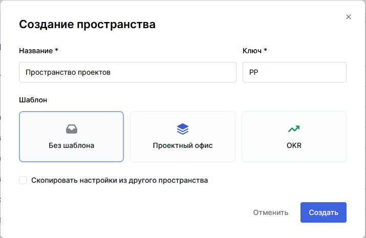

# Руководство пользователя TeamStorm

## Назначение документа 

Документ описывает работу пользователей в системе TeamStorm.

## Описание ролей пользователей Системы

### Core Admin

Роль **Core Admin** предназначена для:

* добавления лицензий продукта;
* выдачи системных ролей пользователям и группам пользователей.

После входа в систему пользователя с ролью **Core Admin** у него будет автоматически открыт раздел **Администрирование.**&#x20;

Подробнее работа с разделом **Администрирование** описана в [Руководстве администратора](rukovodstvo-administratora-teamstorm-po-dobavleniyu-polzovatelei.md).

### Пользователь TeamStorm

Роль **Пользователь TeamStorm** предназначена для работы с основной функциональностью системы.&#x20;

После входа в систему пользователя с ролью **Пользователь TeamStorm** у него будет автоматически открыта [#glavnaya-stranica](rukovodstvo-polzovatelya-teamstorm.md#glavnaya-stranica "mention").

## Вход в систему 

### С использованием Test IT

1. Откройте страницу входа, общую для TeamStorm и Test IT.
2. Выберите локальную учетную запись или вход из домена, если настроены подключения к LDAP-серверам, например к Active Directory, для авторизации с помощью пользователя AD.&#x20;
3. **Опционально:** поставьте флажок **Запомнить меня**, чтобы не вводить учетные данные при следующем открытии браузера.
4.  Введите учетные данные пользователя и нажмите **Войти**.&#x20;

    <figure><figcaption></figcaption></figure>
5. Если по умолчанию открылась система Test IT, то на открывшейся главной странице системы  нажмите иконку выбора продукта в правом верхнем углу экрана.
6.  Выберите TeamStorm.&#x20;

    <figure><figcaption></figcaption></figure>

### Без использования Test IT

1. Откройте страницу входа в TeamStorm.
2. В выпадающем списке выберите тип пользователя, с помощью которого вы войдете в систему. По умолчанию указано значение Local — локальный пользователь TeamStorm . Дополнительно в списке могут отображаться подключения к LDAP-серверам, например к Active Directory, для авторизации с помощью пользователя AD.
3. Введите учетные данные пользователя в поля **Имя пользователя** и **Пароль.**
4. **Опционально:** поставьте флажок **Запомнить меня**, чтобы не вводить учетные данные при следующем открытии браузера.
5. Нажмите **Войти** или клавишу `Enter`**.**

<figure><figcaption></figcaption></figure>

## Главная страница

В результате успешного входа в систему откроется **Главная страница.**

На **Главной странице** отображается:

* количество и список доступных пользователю пространств;
* количество и список пришедших пользователю уведомлений;
* количество и список назначенных пользователю задач.

В верхней части **Главной страницы** находятся:

* поле ввода для поиска задачи;
* индикатор уведомлений;
* иконка [меню информации о продукте](rukovodstvo-polzovatelya-teamstorm.md#menyu-informacii-o-produkte);
* кнопка перехода к профилю пользователя.

<figure><figcaption></figcaption></figure>

Для перехода на главную страницу с других страниц нажмите надпись **Главная** или **TeamStorm** в левом верхнем углу экрана.

## Меню информации о продукте

Меню состоит из разделов:

* **Документация**;
* **О продукте**.

Для вызова меню нажмите кнопку  на **Главной панели**.

При выборе раздела **Документация** откроется страница с документами на систему TeamStorm.

При выборе раздела **О продукте** откроется окно, где указаны:

* название продукта;
* версия продукта;
* ветка версии;
* хеш коммита.

## Работа с пространствами

Принципы выделения пространств принимаются на уровне организации.

Владелец пространства (пользователь, создавший пространство) может предоставлять доступ к данному пространству другим пользователям.

### Создание пространства

1. На **Главной странице**  нажмите кнопку **+ Пространство**.
2. В открывшемся окне введите:
   * название нового пространства;
   * префикс нового пространства (если префикс не ввести, он будет присвоен автоматически);
3. Нажмите **Создать**.

<figure><figcaption></figcaption></figure>

Созданное пространство отобразится в списке пространств на **Главной странице**.

#### Первый вход в созданное пространство

1. Нажмите на название пространства в списке пространств на **Главной странице.**
2. В открывшемся окне с надписью "Пространство не содержит папок" перейти к [созданию папки](rukovodstvo-polzovatelya-teamstorm.md#sozdanie-papki) либо к [настройкам пространства](rukovodstvo-polzovatelya-teamstorm.md#nastroika-prostranstva).

<figure><figcaption></figcaption></figure>

### Переход к пространству

Для перехода к ранее созданному пространству нажмите на название пространства в списке пространств на **Главной странице.**

На открывшейся странице отобразятся задачи из первой созданной в данном пространстве папки.

<figure><figcaption></figcaption></figure>

### Настройки пространства

Доступ к настройкам пространства открывается при

* [первом входе в созданное пространство](rukovodstvo-polzovatelya-teamstorm.md#pervyi-vkhod-v-sozdannoe-prostranstvo) или
* [переходах к ранее созданному пространству](rukovodstvo-polzovatelya-teamstorm.md#undefined) по нажатию кнопки  (3) (1) (1) (1) (1) (10) (1) (7).png>) .

<figure><figcaption></figcaption></figure>

На открывшейся странице вы можете:

* задать название пространства;
* ввести описание пространства;
* удалить пространство.

В левой панели вы можете перейти к

* добавлению или удалению пользователей в пространстве;
* настройке процессов, которые используются в пространстве;
* настройке типов задач, которые используются в пространстве;
* настройке атрибутов, которые используются в пространстве.

<figure><figcaption></figcaption></figure>

#### Добавление и удаление пользователей в пространство

Для добавления пользователей:

1. В  левой панели окна настроек пространства нажмите **Пользователи**.
2. На открывшемся экране **Пользователи** нажмите **Добавить**.&#x20;
3. В открывшемся модальном окне кликните в поле ввода или начните вводить имя пользователя.
4. Выберите нужных пользователей из открывшегося списка и нажмите в любое место модального окна, чтобы закрыть список.
5. Нажмите **Добавить**.

Добавленные пользователи и их роли будут отображены в списке пользователей.&#x20;

<figure><figcaption></figcaption></figure>

Для удаления пользователей:

1. Выберите пользователя из списка и нажмите .
2. В открывшемся модальном окне нажмите **Да, удалить пользователя из пространства.**

Выбранный пользователь будет удален из пространства.

#### Настройка процессов

Настройка процессов в пространстве описана в разделе [#nastroika-rabochikh-processov](rukovodstvo-polzovatelya-teamstorm.md#nastroika-rabochikh-processov "mention").

#### Создание, удаление и редактирование типов задач

Для создания нового типа задачи в пространстве:

1. В левой панели окна настроек пространства нажмите **Типы задач**.
2. На открывшемся экране **Типы задач** нажмите **Создать**.
3. В открывшемся окне заполните поля:
   * Название;
   * Иконка;
   * Цвет иконки;
   * Процесс.
4. Нажмите **Сохранить**.

<figure><figcaption></figcaption></figure>

Новый тип задачи будет отображен в списке типов на экране **Типы задач**.

Для удаления типа задач из пространства:

1. Выберите в списке тип, который необходимо удалить, и нажмите .
2. В открывшемся модальном окне нажмите **Да, я хочу удалить тип**.

Тип будет безвозвратно удален, все связанные с ним задачи сбросят поле Тип и удалены не будут.

Для редактирования типа задач:

1. Выберите в списке тип, который необходимо отредактировать, и нажмите .
2. В открывшемся окне отредактируйте поля
   * Название;
   * Иконка;
   * Цвет иконки;
   * Процесс.
3. Нажмите **Сохранить**.

#### Создание, редактирование и удаление атрибутов

Для создания нового атрибута:

1. В левой панели окна настроек пространства нажмите **Атрибуты**.
2. На открывшемся экране атрибутов нажмите **Создать**.
3. В открывшемся окне заполните поля:
   * Название (обязательно);
   * Описание;
   * Привязать к типу задачи;
   * Формат (обязательно).
4. Нажмите Сохранить.

<figure><figcaption></figcaption></figure>

Созданный атрибут будет отображен в списке атрибутов для данного пространства.&#x20;

Для удаления атрибута из пространства:

1. Выберите в списке атрибут, который необходимо удалить, и нажмите .
2. Нажмите **Да, я хочу удалить атрибут**.

Удаление атрибута приведет к потере всех значений данного атрибута во всех элементах.

Для редактирования атрибута:

1. Выберите в списке атрибут, который необходимо отредактировать, и нажмите .
2. Отредактируйте поля:
   * Название;
   * Описание;
   * Привязать к типу задачи.
3. Нажмите **Сохранить**.

Формат атрибута задается при создании и редактированию не подлежит.&#x20;

## Работа с папками

Папка объединяет задачи со схожими процессами и доступами (например, группировка работы по проектам, продуктам, командам).

Конфигурация рабочих процессов и типов для папки соответствует конфигурации пространства.

Пользователь может создавать вложенные папки.&#x20;

Если папка содержит вложенные папки или расширения, то в навигационной панели рядом с названием папки будет отображена кнопка раскрытия вложенных папок .&#x20;

Если папка не содержит вложенных папок или расширений, то кнопка раскрытия не отображается.&#x20;

### Создание папки

1. Перейти в пространство, в котором требуется создать папку.
2.  Если пространство не содержит папок, то на открывшейся странице нажмите кнопку **Создать папку.** Если пространство содержит ранее созданные папки, нажмите кнопку  (1) (1) (23).png>) рядом с названием пространства.

    <figure><figcaption></figcaption></figure>
3.  В открывшемся окне введите название папки и нажмите **Создать**.

    <figure><figcaption></figcaption></figure>

#### Создание вложенной папки

Выполняется аналогично созданию папки в пространстве, но на шаге 2 следует нажать кнопку  (1) (1) (11).png>) напротив названия той папки, в которой вы хотите создать вложенную папку.

<figure><figcaption></figcaption></figure>

### Изменение папки

1. Нажмите  рядом с названием папки и нажмите пункт меню **Настройки**.
2. В открывшемся окне в блоке **Настройки** введите
   * новое название папки;
   * описание папки.
3. Нажмите **Сохранить.**

### Удаление папки

1. Нажмите  рядом с названием папки.
2. В открывшемся окне в блоке **Удаление** введите название удаляемой папки.
3. Нажмите **Удалить.**

### Перемещение папки

TeamStorm позволяет легко перемещать папки, перетаскивая их из одной в другую или в корень рабочего пространства.&#x20;

Для перемещения папки:

1. Захватите папку при помощи левой клавиши мыши (или другого манипулятора).
2.  Перетащите папку в другую папку или в корень рабочего пространства (для этого выберите любое не занятое место в панели навигации) и отпустите клавишу.

    <figure><figcaption></figcaption></figure>

Если перемещение произошло успешно, отобразится уведомление, содержащее активные ссылки на папки, между которыми произошло перемещение.&#x20;

<figure><figcaption></figcaption></figure>

Невозможно перемещение в следующих случаях:

* при попытке перенести папку в очередь,
* при попытке перенести папку в расширение,
* при попытке перенести папку в ту локацию, где она уже находится,
* при попытке перенести папку в саму себя,

В каждом из этих случаев отобразится соответствующее уведомление.

<figure><figcaption></figcaption></figure>

## Работа с расширениями

### **Включение расширения (Agile)**

1. Перейдите в нужное пространство.
2. Нажмите  рядом с названием папки,  для которой хотите включить расширение, и выберите в меню пункт **Расширения**.
3. Нажмите **Включить Agile**.

В случае выбора расширения **Agile** для выбранной папки будет автоматически создана очередь **Backlog**. Очередь **Backlog** используется для создания упорядоченных по приоритету списков работы команды, которая работает по методологии Agile.&#x20;

Если команда в работе использует фреймфорк Scrum, то выполнение работы организуется с помощью спринтов — фиксированных периодов времени в течение которого будет выполнена вся запланированная в них работа.

Спринт представляет собой упорядоченный список задач (очередь). Для спринта устанавливается сроки, длительность и предполагаемый объем работы, который команда может выполнить в указанный срок. Наполнение спринта происходит как правило через **Backlog**. Команда выбирает задачи, которые имеют более высокий приоритет до тех пор, пока не наберет достаточный объем задач.

### Создание спринта в расширении Agile

1. Выберите папку, для которой подключено раcширение **Agile**.
2. При необходимости при помощи навигационных кнопок  (4) (1).png>) разверните список расширений и очередей выбранной папки.
3.  Напротив расширения **Agile** нажмите

    * кнопку вызова меню  (5) (1).png>), затем выберите **Добавить спринт**

    или

    * кнопку  (4) (1).png>).
4. В открывшемся модальном окне заполните  поля:
   * Название;
   * Дата начала;
   * Дата завершения;
   * Описание (заполняется опционально).
5. Нажмите **Создать**.

<figure><figcaption></figcaption></figure>

Будет открыто [представление задач](rukovodstvo-polzovatelya-teamstorm.md#predstavlenie-zadach) для созданного спринта.

### Запуск спринта

В представлении задач выбранного спринта нажмите **Запустить спринт** в верхней правой части представления.

Запущенный спринт будет помечен зеленой точкой в панели навигации справа.

### Редактирование спринта

1. Нажмите  напротив нужного спринта в панели навигации в правой части экрана или в правом верхнем углу в представлении задач выбранного спринта и выберите **Настроить**.
2. Измените данные (название, даты начала и окончания, количество рабочих дней, описание спринта).
3. Нажмите **Сохранить**.

### Добавление команды в спринт

Существует два способа добавления команды в спринт:

* добавление участников в команду;
* копирование команды из другого спринта.

#### Добавление участников в команду

1. Перейдите в спринт, в который требуется добавить команду.
2. Нажмите **Добавить команду** в правой верхней части экрана.
3. В открывшемся модальном окне нажмите **Добавить участника**.
4.  Выберите участников и щелкните на свободное место в модальном окне.&#x20;

    <figure><figcaption></figcaption></figure>
5.  В отобразившихся полях для каждого участника введите количество дней отпуска и количество часов, которые участник работает в день в рамках спринта.&#x20;

    <figure><figcaption></figcaption></figure>
6. Нажмите **Сохранить**.&#x20;

В правой верхней части экрана будет отображена аналитическая диаграмма, показывающая:

* емкость команды (в часах);
* все оценки по задачам (в часах).

<figure><figcaption></figcaption></figure>


Емкость команды вычисляется как произведение количества сотрудников в команде на количество рабочих часов сотрудника в день и на количество рабочих дней в спринте за вычетом возможных дней отпуска сотрудника.

Оценка времени по задачам вычисляется как сумма оценок времени выполнения всех задач спринта.


#### Копирование команды в спринт

1. Перейдите в спринт, в который требуется добавить команду.
2. Нажмите **Добавить команду** в правой верхней части экрана.
3. В открывшемся модальном окне нажмите **Скопировать из спринта**.
4. Выберите из списка спринт, из которого требуется скопировать команду.
5. При необходимости отредактируйте в отобразившихся полях  количество дней отпуска каждого участника и количество часов, которые участник работает в день в рамках спринта.&#x20;
6. Нажмите **Сохранить**.&#x20;


При копировании команды из другого спринта по умолчанию копируется количество часов, которые каждый участник работает в день. Количество дней отпуска не копируется.&#x20;


### Редактирование команды спринта

1. Перейти в спринт, в котором нужно отредактировать команду.
2.  Нажать  в правом верхнем углу экрана и выбрать **Редактировать команду**.

    <figure><figcaption></figcaption></figure>
3. В открывшемся модальном окне отредактировать состав и другие параметры команды (подробнее в разделе [Добавление участников в команду](rukovodstvo-polzovatelya-teamstorm.md#dobavlenie-uchastnikov-v-komandu)).
4. Нажать **Сохранить**.

В результате изменятся данные, отображаемые в аналитической диаграмме **Емкость команды**.&#x20;

### Завершение спринта

1. В представлении задач выбранного спринта нажмите **Завершить спринт** в верхней правой части представления.
2. В открывшемся модальном окне нажмите **Завершить**.

Завершенный спринт перестанет быть помеченным зеленой точкой в панели навигации слева.

Спринт будет перенесен в архив и его невозможно будет вернуть в очередь. Все незавершенные задачи будут перенесены в **Backlog**.

Архив автоматически создается в расширении **Agile** при завершении хотя бы одного спринта.&#x20;

### Удаление спринта

1. Нажмите  напротив нужного спринта в панели навигации в правой части экрана или в правом верхнем углу в представлении задач выбранного спринта.
2. Нажмите **Удалить**.
3. В открывшемся модальном окне нажмите **Да, я хочу удалить спринт**.

Спринт будет безвозвратно удален, все задачи, которые были в спринте, сбросят поле **Спринт** и удалены не будут.


Удалить можно только свежесозданный или запущенный спринт.&#x20;

Завершенный спринт удалить нельзя.


### **Отключение расширения (Agile)**

1. Выберите папку, для которой подключено раcширение **Agile**.
2. Нажмите  рядом с названием папки и выберите в меню пункт **Расширения**.
3. Нажмите **Удалить Agile**.
4. В появившемся модельном окне нажмите **Да, я хочу удалить Agile**.

Расширение будет  удалено, все задачи, которые были добавлены в очереди **Backlog** и **Спринт** сбросят поле **Спринт** и удалены не будут.

## Работа с задачами

В системе доступно создание разных типов задач — структурированных элементов для управления проектом.

Пользователь может:

* вносить информацию о необходимых действиях для выполнения задачи;
* устанавливать исполнителя задачи;
* изменять статус по мере выполнения задачи и закрывать её;
* добавлять вложения (файлы);
* выстраивать иерархию задач, добавляя вложенные задачи;
* оставлять комментарии к задаче;
* создавать к задачам пользовательские атрибуты типов «строка», «тег», «список», «дата», «число»;
* связывать задачи, выстраивая между ними отношения типа «зависимость», «блокирование», «дублирование»;
* указывать рабочий процесс, по которому должна проходить задача.

### Представление задач

Вся информация о выполнении задач отслеживается с помощью двух представлений — «Доска» и «Таблица».

Таблица представляет собой список задач с параметрами.&#x20;

Доска представляет собой набор карточек задач, сгруппированных по статусам в колонках доски.

Представления отображают задачи выбранной папки или списка задач. В представлениях доступны [фильтрация и поиск](rukovodstvo-polzovatelya-teamstorm.md#filtraciya-i-poisk) отображаемых задач по названию, статусу, типу и ответственному за задачу.

Для переключения между представлениями нажмите **Доска** или **Таблица** на переключателе в верхней части представления. Выбранный тип представления будет подчеркнут и выделен цветом.

<figure><figcaption>
Представление «Доска»
</figcaption></figure>

<figure><figcaption>
Представление  «Таблица»
</figcaption></figure>

Если задача в представлении **Таблица** содержит подзадачи, то рядом с названием задачи располагается кнопка раскрытия списка подзадач .

В раскрытом списке подзадачи отображаются в хронологическом порядке: от более новых вверху к более старым внизу.

#### Количество задач в папке или очереди

Задачи в представлениях отображаются по мере прокручивания таблицы или колонки на доске.&#x20;

Так как количество задач в папке или очереди может быть очень большим, в правом верхнем углу любого из представлений под кнопкой **Добавить задачу** отображается количество задач.

Если не применены [фильтрация или поиск](rukovodstvo-polzovatelya-teamstorm.md#filtraciya-zadach) задач, то отображается одно число — общее количество задач для данной папки или очереди на всех уровнях вложенности.

<figure><figcaption></figcaption></figure>

Если применены фильтры или заполнено поле поиска, то отображаются два числа:

* количество задач, соответствующее результатам фильтрации или поиска, на всех уровнях вложенности;
* общее количество задач для данной папки или очереди на всех уровнях вложенности.

<figure><figcaption></figcaption></figure>

#### Настройка представлений

Кнопка настройки представлений расположена в правой верхней части представления.

Для представления «Таблица» реализована возможность выбора атрибутов, отображаемых в представлении.&#x20;

1. Переключите представление на тип  «Таблица».
2. Нажмите **Настроить**, затем **Атрибуты.**
3. В отобразившейся панели отметьте те атрибуты, которые требуется видеть в представлении или снимите отметки с тех атрибутов, которые требуется скрыть.

<figure><figcaption></figcaption></figure>

Таблица представления задач будет содержать столбцы только с отмеченными на панели настройки атрибутами.&#x20;

Для представления «Доска» реализована возможность выбора статусов, отображаемых в представлении.&#x20;

1. Переключите представление на тип «Доска».
2. Нажмите **Настроить**, затем **Статусы и процессы.**
3. В отобразившейся панели отметьте те статусы и/или процессы, которые требуется видеть в представлении или снимите отметки с тех статусов или процессов, которые требуется скрыть.&#x20;

<figure><figcaption></figcaption></figure>


При выборе процесса выбираются все статусы, входящие в процесс.

При снятии выбора с процесса сбрасываются все входящие в него статусы.

При снятии выбора с отдельного статуса, выбор снимается со статуса во всех процессах, в которые он добавлен.

По умолчанию выбраны все процессы, которые существуют в пространстве на момент создания папки.


### Фильтрация и поиск

#### Фильтрация задач

В представлениях задач по умолчанию доступна фильтрация по следующим системным атрибутам:

* Статус;
* Ответственный;
* Тип.

При помощи [настройки фильтров](rukovodstvo-polzovatelya-teamstorm.md#nastroika-filtrov) можно добавить следующие системные атрибуты:

* Автор;
* Автор изменения;
* Дата выполнения;
* Дата завершения;
* Дата изменения;
* Дата создания.

Кроме того в представлении «Доска» по умолчанию доступна фильтрация по атрибуту

* Процессы.

Для фильтрации задач:

1. Нажмите название фильтра (Например - **Статус)**.
2. Выберите значения атрибута (одно или несколько), по которым будет производиться фильтрация.&#x20;
3. В отобразившемся меню выберите оператор фильтрации (набор операторов может отличаться в зависимости от выбранного фильтра):
   * Равен — будут отображены задачи со значениями, равными выбранным ;
   * Не равен — будут отображены все задачи, кроме задач с выбранными значениями;
   * Заполнен — будут отображены задачи, у которых выбранный атрибут заполнен любым значением;
   * Не заполнен — будут отображены задачи, у которых выбранный атрибут не заполнен каким-либо значением;
   * Любой из указанных — будут отображены задачи, у которых атрибут соответствует любой из выбранных опций;
   * Все из указанных — будут отображены задачи, у которых опции атрибута включает все выбранные опции;
   * Ни один из указанных — будут отображены задачи, у которых опции атрибута не соответствуют хотя бы одной из выбранных опций;
   * Не равно всем указанным — будут отображены задачи, у которых опции атрибута не соответствуют всем выбранным опциям
4. Для закрытия меню щелкните на любое место на экране представления.

Шаги 2 и 3 можно менять по порядку выполнения, если это более удобно пользователю.&#x20;

<figure><figcaption></figcaption></figure>

 

<figure><figcaption></figcaption></figure>

На экране представления будут отображены задачи, отфильтрованные по соответствующим параметрам.&#x20;


Кнопка **Скрыть** скрывает фильтр по текущему параметру из представления.


#### Фильтрация по пользовательским атрибутам

Фильтрация задач в представлениях возможна по пользовательским атрибутам определенных форматов, в частности:

* Список;
* Тег;
* Пользователь.

Рассмотрим фильтрацию по пользовательскому атрибуту на примере атрибута формата «Список»:

1. После [создания пользовательского атрибута ](rukovodstvo-polzovatelya-teamstorm.md#sozdanie-redaktirovanie-i-udalenie-atributov)перейдите к [настройке фильтров](rukovodstvo-polzovatelya-teamstorm.md#nastroika-filtrov).
2. В меню настройки фильтров проставьте отметку напротив параметра «Список».&#x20;
3. После того, как в представлении задач отобразится фильтр «Список», следуйте указаниям из раздела [Фильтрация задач](rukovodstvo-polzovatelya-teamstorm.md#filtraciya-zadach).

Фильтрация по другим пользовательским атрибутам осуществляется аналогично.&#x20;

#### Настройка фильтров

1. В правой части представления задач нажмите **Фильтры**.
2. В отобразившемся меню проставьте отметки напротив названия тех фильтров, которые хотите использовать или снимите отметки напротив названия тех фильтров, которые хотите исключить.&#x20;

<figure><figcaption></figcaption></figure>

Выбранные фильтры будут отображены в любом типе представления задач для папки или очереди.&#x20;

#### Поиск задачи

В представлении задач данной папки или очереди начните вводить название или буквенно-числовой идентификатор задачи.

<figure><figcaption></figcaption></figure>

Результаты поиска будут динамически отображаться в представлении.&#x20;

### Создание задачи

1. Перейдите в папку, в которой требуется создать новую задачу.
2. На открывшейся странице нажмите кнопку **+ Задача**.
3. В открывшемся окне заполните поля:
   * Название;
   * Ответственный;
   * Тип (по умолчанию — Task);
   * Описание;
   * Дата выполнения.
4. Нажмите **Создать**.

<figure><figcaption></figcaption></figure>

#### Клонирование задачи

Для быстрого создания задач можно использовать клонирование задачи:

1. Перейдите в карточку задачи, которую нужно клонировать.
2. Нажмите  и выберите **Клонировать задачу.**

В папке с исходной задачей будет создана новая задача с названием вида _Копия \[название исходной задачи]._&#x20;

Клонированная задача будет содержать те же атрибуты и вложения, что и исходная. Автором задачи будет назначен тот, кто клонировал задачу. Ответственный не назначается. Автоматически устанавливается связь с исходной задачей. &#x20;

### Карточка задачи

Карточка задачи — это открывающаяся в правой части экрана панель, которая отображается при выборе задачи в [Представлении задач](rukovodstvo-polzovatelya-teamstorm.md#predstavlenie-zadach).&#x20;

Карточка состоит из блоков:

1. Основной блок, содержащий следующие изменяемые элементы:
   * Название задачи;
   * Ответственный;
   * Статус;
   * Дата выполнения;
   * Спринт;
   * Оценка;
   * Учет времени.
2. Блок "Описание".
3. Блок "Подзадачи".
4. Блок "Связанные задачи".
5. Блок "Вложения".
6. Блок комментариев и истории изменения атрибутов.

<figure><figcaption></figcaption></figure>

<figure><figcaption></figcaption></figure>


Не следует путать полную карточку задачи и карточку в представлении "Таблица".


### Редактирование задачи

1. Откройте [представление задач](rukovodstvo-polzovatelya-teamstorm.md#predstavlenie-zadach) в выбранной папке.
2. Нажмите на нужную задачу.
3. В открывшейся справа [Карточке задачи](rukovodstvo-polzovatelya-teamstorm.md#kartochka-zadachi) измените:
   * название задачи;
   * ответственного;
   * [статус](rukovodstvo-polzovatelya-teamstorm.md#izmenenie-statusa-zadachi);
   * дату выполнения;
   * [спринт](rukovodstvo-polzovatelya-teamstorm.md#vklyuchenie-rasshireniya-agile) (отображается только если задача [добавлена в какую-либо из очередей](rukovodstvo-polzovatelya-teamstorm.md#dobavlenie-zadachi-v-ochered-i-udalenie-zadachi-iz-ocheredi));
   * оценку времени выполнения;
   * учет затраченного времени.
4. При необходимости [отредактируйте описание задачи](rukovodstvo-polzovatelya-teamstorm.md#sozdanie-i-redaktirovanie-opisanii-i-kommentariev-k-zadacham), связанные задачи, добавьте или удалите вложения, [добавьте или удалите комментарий](rukovodstvo-polzovatelya-teamstorm.md#sozdanie-i-redaktirovanie-opisanii-i-kommentariev-k-zadacham).
5. Закройте панель, нажав  в правом верхнем углу панели.

В представлении типа «Таблица» есть возможность редактировать часть параметров непосредственно в представлении, не переходя в панель редактирования.&#x20;

Для этого:

1. Выберите строку с нужной задачей и столбец с атрибутом, который необходимо отредактировать.
2. Нажмите на выбранный атрибут и измените его при помощи отобразившегося меню.&#x20;

<figure><figcaption></figcaption></figure>

В представлении типа «Доска» есть возможность изменять ответственного за выполнение задачи.&#x20;

Для этого:

1. Выберите на доске карточку задачи и в ней нажмите на значок с инициалами ответственного;
2. В отобразившемся меню выберите ответственного.

<figure><figcaption></figcaption></figure>

#### Изменение статуса задачи

Изменение статуса задачи необходимо для отслеживания прогресса выполнения задачи.&#x20;

Все статусы относятся к четырем основными категориям:

* TO DO — задачи, которые требуется выполнить, выделяется темно-серым цветом;
* IN PROGRESS  — задачи, которые находятся в процессе выполнения, выделяются синим цветом;
* DONE  — завершенные задачи, выделяются зеленым цветом;
* CANCELLED  — отмененные задачи, выделяются красным цветом.&#x20;

<figure><figcaption></figcaption></figure>

Пользователь с правами редактирования пространства может создавать пользовательские статусы в рамках [настройки рабочего процесса](rukovodstvo-polzovatelya-teamstorm.md#nastroika-rabochikh-processov), тем не менее, созданные статусы будут относиться к описанным выше категориям.&#x20;

При переводе задачи в статус DONE или CANCELLED в панели редактирования задачи отображается поле **Дата завершения**, которое автоматически заполняется значением с текущими датой и временем.&#x20;

При переводе задачи из статусов DONE или CANCELLED в TO DO или IN PROGRESS поле **Дата завершения** скрывается и соответствующий атрибут удаляется.&#x20;

#### Добавление задачи в очередь и удаление задачи из очереди

Если для папки включено [расширение Agile](rukovodstvo-polzovatelya-teamstorm.md#rabota-s-rasshireniyami), часть задач, тем не менее, могут не относиться ни к одной из очередей.&#x20;

В этом случае карточка задачи не содержит поля **Спринт**.

Для добавления задачи в очередь:

1. Выберите задачу в представлении.
2.  Нажмите в открывшейся справа панели (карточке задачи).&#x20;

    <figure><figcaption></figcaption></figure>
3. В отобразившемся меню выберите **Добавить в спринт**.
4.  В открывшемся модальном окне выберите нужный спринт.&#x20;

    <figure><figcaption></figcaption></figure>

    В карточке задачи отобразится поле **Спринт**, содержащее название выбранного спринта.&#x20;

Для удаления задачи из очереди нажмите  в поле **Спринт** в карточке задачи.

<figure><figcaption></figcaption></figure>

Задача будет удалена из очереди и поле **Спринт** будет скрыто из карточки задачи.&#x20;

### Форматирование описаний и комментариев к задачам

TeamStorm позволяет создавать подробные, структурированные описания и комментарии к задачам благодаря встроенным инструментам форматирования текста.&#x20;

Инструменты форматирования расположены в верхней части поля ввода текста и отображаются при переводе курсора в это поле.&#x20;

<figure><figcaption></figcaption></figure>

Инструменты редактирования (в порядке справа налево):

* Стиль (заголовок или обычный текст);
* Цвет шрифта;
* Полужирный шрифт;
* Курсивный шрифт;
* Подчеркнутый шрифт;
* Зачеркнутый шрифт;
* Вставить код;
* Вставить блок кода;
* Подстрочный текст;
* Надстрочный текст;
* Нумерованный список;
* Маркированный список;
* Список с отметкой (чекбокс);
* Выровнять по левому краю;
* Выровнять по центру;
* Выровнять по правому краю;
* Вставить ссылку;
* Вставить разделительную черту.

Процессы создания и редактирования описаний и комментариев в общих чертах описаны в разделах [Добавление задачи](rukovodstvo-polzovatelya-teamstorm.md#dobavlenie-zadachi-v-ochered-i-udalenie-zadachi-iz-ocheredi) и [Редактирование задачи](rukovodstvo-polzovatelya-teamstorm.md#redaktirovanie-zadachi).


При редактировании описания задачи **необходимо** после внесения изменений щелкнуть курсором в карточке задачи в любом месте, кроме поля ввода описания.&#x20;

В противном случае изменения могут не сохраниться.&#x20;


### Добавление подзадачи

1. Откройте [представление задач](rukovodstvo-polzovatelya-teamstorm.md#predstavlenie-zadach) в выбранной папке.
2. Нажмите на нужную задачу.
3.  В открывшейся справа панели в блоке **ПОДЗАДАЧИ** нажмите **Добавить.**

    <figure><figcaption></figcaption></figure>
4. В открывшемся окне выберите **Создать** или **Выбрать из существующих**.

Если выбрана вкладка **Создать:**

1. Заполните поля:
   * Название;
   * Тип (по умолчанию — Task);
   * Описание;
   * Дата выполнения.
2. Нажмите кнопку **Создать.**

<figure><figcaption></figcaption></figure>

Если выбрана вкладка **Выбрать из существующих**:

1. В открывшемся окне переведите курсор в поле ввода и начните вводить название ранее созданной задачи.
2. Выберите нужную задачу из раскрывшегося списка и нажмите на неё.

<figure><figcaption></figcaption></figure>

В  блоке **ПОДЗАДАЧИ** отобразятся добавленные подзадачи.

<figure><figcaption></figcaption></figure>

### Добавление и удаление связи между задачами

#### Добавление связи

1. Откройте [представление задач](rukovodstvo-polzovatelya-teamstorm.md#predstavlenie-zadach) в выбранной папке.
2. Нажмите на нужную задачу.
3. В открывшейся справа карточке задачи в блоке **СВЯЗАННЫЕ ЗАДАЧИ** нажмите **Добавить**. (6).png>)
4.  В отобразившемся поле начните вводить название задачи, которую нужно связать с текущей.&#x20;

    <figure><figcaption></figcaption></figure>
5. &#x20;Выберите тип связи задач (по умолчанию — **Связана**).
6. Нажмите 

В  блоке **СВЯЗАННЫЕ ЗАДАЧИ** отобразятся связанные задачи.

<figure><figcaption></figcaption></figure>

Пользователь может выполнить переход к связанной задаче, нажав на ее название блоке **СВЯЗАННЫЕ ЗАДАЧИ.**


Связывание задач доступно в том числе для задач из разных пространств.&#x20;

Для связывания задач из разных пространств пользователю необходимо иметь доступ в те пространства, задачи из которых требуется связать друг с другом.&#x20;


#### Удаление связи

1. Перейдите к блоку **СВЯЗАННЫЕ ЗАДАЧИ** в карточке задачи.
2. Справа от названия задачи, связь с которой требуется удалить, нажмите .
3. Нажмите **Удалить связь.**

Связь будет удалена и связанная задача перестанет отображаться в блоке **СВЯЗАННЫЕ ЗАДАЧИ.**

### Просмотр истории создания и изменения задачи &#x20;

1. Открыть [Карточку задачи](rukovodstvo-polzovatelya-teamstorm.md#kartochka-zadachi).
2. Перейти в блок комментариев и истории изменения атрибутов в нижней части карточки и перейти на вкладку **История.**

В открывшейся вкладке отображается история создания и изменения задачи .

&#x20;Для истории создания указывается:

* автор создания;&#x20;
* тип созданной задачи.&#x20;
* дата и время создания задачи;

Для истории изменения указывается:

* автор изменения;
* атрибут, который был изменен или добавлен;
* факт изменения или добавления описания;
* дата и время изменения атрибута или описания.

<figure><figcaption></figcaption></figure>

### Добавление вложения

1. Откройте [представление задач](rukovodstvo-polzovatelya-teamstorm.md#predstavlenie-zadach) в выбранной папке.
2. Нажмите на нужную задачу.
3.  В открывшейся справа панели в блоке **ВЛОЖЕНИЯ** нажмите иконку добавления файлов.

    <figure><figcaption></figcaption></figure>
4. В открывшемся системном окне перейдите в папку с нужным файлом, выберите файл и подтвердите выбор.

<figure><figcaption></figcaption></figure>

В блоке **ВЛОЖЕНИЯ** отобразится добавленный файл.&#x20;

.png>)

### Ранжирование задач

Ранжирование задач необходимо для упорядочивания списка задач в папке или очереди.&#x20;

Ранжирование задач в папке или очереди выполняется в [представлении ](rukovodstvo-polzovatelya-teamstorm.md#predstavlenie-zadach)«Доска» при помощи перетаскивания.

1. Откройте представление задач в выбранной папке или очереди.
2. Включите представление типа «Доска» (если необходимо).
3. При помощи мыши или другого манипулятора захватите карточку задачи и перетащите ее вверх или вниз в рамках колонки статуса, в которой находится данная задача.
4. Повторите для остальных задач (если необходимо).

<figure><figcaption></figcaption></figure>


Ранжирование задач сохраняется для всех пользователей и на всех устройствах.


### Перемещение задачи

TeamStorm позволяет легко перемещать задачи между папками, используя панель навигации.&#x20;

Для перемещения задачи из одной папки в другую:

1. Откройте [представление задач](rukovodstvo-polzovatelya-teamstorm.md#predstavlenie-zadach) в выбранной папке.
2. Захватите задачу помощи левой клавиши мыши (или другого манипулятора).
3. Перетащите задачу в нужную папку в навигационной панели и отпустите клавишу.

<figure><figcaption></figcaption></figure>

Если перемещение произошло успешно, отобразится уведомление, содержащее активные ссылки на перемещенную задачу и папку в которую произошло перемещение.&#x20;

<figure><figcaption></figcaption></figure>

Невозможно перемещение в следующих случаях:

* при попытке добавить задачу в завершенный спринт,
* при попытке перенести задачу в ту же локацию (папку или очередь), где она уже находится,
* при попытке перенести задачу в Extention и Agile,
* при попытке перенести задачу в корень пространства.

В каждом из этих случаев отобразится соответствующее уведомление.

<figure><figcaption></figcaption></figure>

### Создание ссылки на задачу

1. Откройте [представление задач](rukovodstvo-polzovatelya-teamstorm.md#predstavlenie-zadach) в выбранной папке.
2. Нажмите на нужную задачу.
3. В открывшейся справа панели нажмите кнопку создания ссылки  (3) (1) (1).png>)в правом верхнем углу.

Ссылка на задачу будет автоматически скопирована в буфер обмена.&#x20;

## Настройка рабочих процессов

В пространстве для каждого типа задачи определен процесс по умолчанию. Все процессы определены на уровне пространства и наследуются папками и задачами.

При конфигурировании рабочего процесса пользователь может:

* создавать новые статусы или добавлять существующие;
* удалять статусы из процесса.

### Создание процесса

1. Перейдите в пространство, для которого требуется создать новый процесс.
2. Нажмите  напротив названия пространства в левой части экрана, затем нажмите **Настройки**.
3.  В открывшемся окне перейдите в раздел **Процессы**.

    <figure><figcaption></figcaption></figure>
4. Нажмите **Создать** в правом верхнем углу экрана.
5. В открывшемся окне введите название процесса в поле в верхней части экрана и назначьте процессу статусы, нажав  (1) (1) (5).png>) в блоках статусов и выбрав необходимые для данного процесса статусы и определив их взаимосвязи.
6. Нажмите **Сохранить.**

В случае удачного сохранения процесса в правом нижнем углу экрана отобразится надпись «Процесс сохранен».

<figure><figcaption></figcaption></figure>

### Просмотр списка процессов

1. Перейдите в пространство, в котором требуется просмотреть процессы.
2. Нажмите  напротив названия пространства в левой части экрана, затем нажмите **Настройки**.
3. В открывшемся окне перейдите в раздел **Процессы**.

На открывшейся странице будет отображен список процессов, созданных для данного пространства.

<figure><figcaption></figcaption></figure>

### Создание нового статуса

1. Перейдите в список процессов, как указано в разделе [Просмотр списка процессов](rukovodstvo-polzovatelya-teamstorm.md#undefined).
2. Нажмите на нужный процесс из списка.
3. В открывшемся окне нажмите в том столбце статусов, в котором необходимо создать новый статус.
4. Введите отобразившееся поле название статуса, уникальное для того пространства, в котором вы находитесь.
5. Нажмите **Создать <**_**название статуса**_**>**.

<figure><figcaption></figcaption></figure>

### Удаление статуса из процесса

1. Перейдите в список процессов, как указано в разделе [Просмотр списка процессов](rukovodstvo-polzovatelya-teamstorm.md#undefined).
2. Нажмите на нужный процесс из списка.
3. В открывшемся окне выберите статус, который хотите удалить и кликните на него правой кнопкой мыши.
4. Нажмите **Удалить из процесса**.

<figure><figcaption></figcaption></figure>

## Выгрузка данных

Выгрузка данных доступна как для пространств целиком, так и для созданных в этих пространствах папок, включая вложенные папки и папки, создаваемые в расширениях.&#x20;

Выгрузка выполняется в формате CSV.

Доступно два типа выгрузки:

* выгрузка данных о задачах;
* выгрузка данных о списании трудозатрат.

### Выгрузка данных о задачах

1. Нажмите  напротив названия пространства или папки, из которых вы хотите сделать выгрузку.
2. В открывшемся меню выберите **Выгрузить**, затем нажмите **Задачи в .CSV**.

<figure><figcaption></figcaption></figure>

Процесс сохранения файла с выгрузкой начнется в браузере без дополнительного подтверждения.&#x20;

По окончании процесса сохранения перейдите в меню загрузок вашего браузера. Файл с выгрузкой данных будет иметь название вида \[Название пространства] + \[дата+время выгрузки].csv.

<figure><figcaption></figcaption></figure>

### Выгрузка данных о списании трудозатрат

1. Нажмите  напротив названия пространства или папки, из которых вы хотите сделать выгрузку.
2. В открывшемся меню выберите **Выгрузить**, затем нажмите **Списания в .CSV**.

<figure><figcaption></figcaption></figure>

Процесс сохранения файла с выгрузкой начнется в браузере без дополнительного подтверждения.&#x20;

По окончании процесса сохранения перейдите в меню загрузок вашего браузера. Файл с выгрузкой данных будет иметь название вида Worklog\_ + \[дата+время выгрузки].csv.

<figure><figcaption></figcaption></figure>

## Уведомления

TeamStorm уведомляет об основных событиях, происходящих в системе и касающихся пользователя:

* назначение на пользователя новой задачи;
* изменение ответственного (для всех подписанных на получение уведомлений);
* добавление комментария к задаче;
* изменение статуса задачи;
* изменение даты выполнения задачи.&#x20;


Пользователю не приходят уведомления по изменениям, внесенным им самим.


Индикатор уведомлений со счетчиком новых сообщений находится в правом верхнем углу экрана.&#x20;

<figure><figcaption></figcaption></figure>

Для просмотра уведомлений нажмите на индикатор.&#x20;

В открывшемся списке уведомления сгруппированы по задачам и расположены в хронологическом порядке от более новых к более старым. Непрочитанные уведомления выделены полужирным шрифтом и отмечены активной радиокнопкой синего цвета.&#x20;

Уведомление содержит:

* номер  и наименование задачи с активной ссылкой на задачу;
* наименование измененного параметра;
* сведения об авторе изменения;
* дату и время изменения ( если изменение выполнено в текущий день, то отображается только время).

<figure><figcaption></figcaption></figure>

Отметить все уведомления как прочитанные можно при помощи кнопки **Прочитать все**.

Отдельные уведомления можно отмечать прочитанными или непрочитанными при помощи радиокнопки, которая подсвечивается, если уведомление выделено курсором.&#x20;

При нажатии на уведомление откроется карточка задачи, с которой связано уведомление.&#x20;

### Подписка на уведомления

TeamStorm автоматически подписывает пользователя на уведомления в следующих случаях:

* автора задачи при создании задачи;
* ответственного за выполнение задачи при его назначении.

Подписка автоматически отменяется в следующих случаях:

* если пользователь более не является ответственным по задаче (при условии, что он не является автором задачи или не подписан на задачу вручную);
* если пользователь удален из пространства, в котором создана задача.

Для подписки на уведомления вручную:

1. Перейдите в карточку задачи, для которой нужно включить уведомления.
2. Нажмите кнопку **Отслеживать**  в правом верхнем углу карточки задачи.

На главном экране отобразится надпись **Вы подписаны на задачу \[идентификатор задачи]**.

Кнопка **Отслеживать** изменит пиктограмму и состояние на **Перестать отслеживать**.

Для отмены подписки:

1. Перейдите в карточку задачи, для которой нужно отключить уведомления.
2. Нажмите кнопку **Перестать отслеживать**  в правом верхнем углу карточки задачи.

На главном экране отобразится надпись **Вы отписаны от задачи \[идентификатор задачи]**.

Кнопка **Перестать отслеживать** изменит пиктограмму и состояние на **Отслеживать**.
